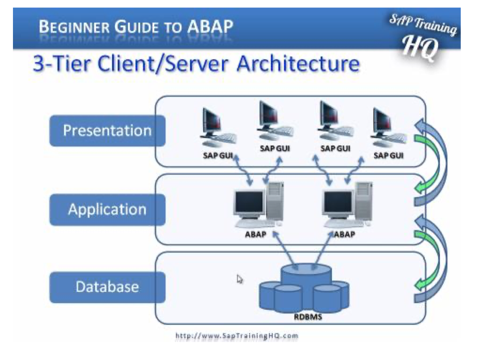

# SAP-Practice

In any typical SAP implementation, at the top is the Presentation server, which is any input device that can be used to control an SAP system (the diagram shows the SAP GUI, but this could equally be a web browser, a mobile device, and so on). The Presentation layer communicates with the Application server, and the Application server is the 'brains' of an SAP system, where all the central processing takes place. The Application server is not just one system in itself, but can be made up of multiple instances of the processing system. The Application server, in turn, communicates with the Database layer. The Database is kept on a separate server, mainly for performance reasons, but also for security, providing a separation between the different layers of the system. Communication happens between each layer of the system, from the Presentation layer, to the Application server, to the Database, and then back up the chain, through the Application server again, for further processing, until finally reaching the Presentation layer.

# Environment for Programs

Next, we have the environment which programs run in, the Work Processes, and the structure of an ABAP program. **Within an SAP system, or at least the example used here, there are two types of programs, Reports and Dynpro’s.** 

Reports, as the name would suggest, are programs which generate lists of data. They may involve a small amount of interactivity, but mainly they supply data to the front-end interfaces, the SAP GUI and so on. When a user runs a report, they typically get a selection screen. Once they enter their selection parameters and execute the report, they normally cannot intervene in the execution of the program. The program runs, and then displays the output. Dynpro’s are slightly different. They are dynamic programs, and allow the user to intervene in the execution of the program, by processing a series of screens, called Dialogue screens. The user determines the flow of the program itself by choosing which buttons or fields to interact with on the screen. Their action then triggers different functions which have been coded within the flow logic of the program. While reports are being created, interfaces are also to be generated which are classed as Dynpro’s, for all the selection criteria. 

**Most of the work done by people involved with ABAP is done within Report programs**, and even though these programs are labelled 'Reports', they do not always generate output. The Report programs are there to process the logic, reading and writing to the Database, in order to make the system work.

## Work Processes

Every program that runs in an SAP system runs on what are called Work Processes, which run on the Application server. Work Processes themselves work independently of the computer's operating system and the Database that it interacts with, giving the independence discussed earlier with regard to the Technical architecture. When an SAP system is initially set up, the basis consultants (who install the system, keep it running, manage all the memory and so on) configure SAP in such a way that it automatically sets the number of Work Processes programs use when they start, the equivalent of setting up a pre-defined number of channels or connections to the Database system itself, each of which tend to have their own set of properties and functions.

## The Dispatcher

You might come across something referred to as the Dispatcher. The SAP system has no technical limits as to the number of users who can log on and use it, generally the number of users who can access an SAP system is much larger than the number of available Work Processes the system is configured for. This is because not everybody is sending instructions to the Application server at exactly the same time. Because of this, users cannot be assigned a certain number of processes while they are logged on.

**The Dispatcher controls the distribution of the Work Processes to the system users.** The Dispatcher keeps an eye on how many Work Processes are available, and when a user triggers a transaction, the Dispatcher's job is to provide that user with a Work Process to use. The Dispatcher tries to optimise things as far as possible, so that the same Work Process receives the sequential Dialogue steps of an application. If this is not possible, for example because the user takes a long time between clicking different aspects of the screen, it will then select a different Work Process to continue the processing of the Dialogue program. It is the Work Process which executes an application, and it is the Work Process which has access to the memory areas that contain all of the data and objects an application uses. It also makes three very important elements available.

## The Database Interface

The Database Interface is the third important element. It is a set of ABAP statements that are Database independent. What this means is that a set of ABAP statements can be used that, in turn, can communicate with any type of Database that has been installed when the system was set up. Whether this is, for example, a Microsoft SQL server or an Oracle Database, you can use the same ABAP statements, called Open SQL, to control the entire Database reading and writing over the Database Interface. The great advantage of this is that the ABAP statements have encapsulation, meaning the programmers do not need to know which physical Database system the ABAP system they are using actually supports.

There are times when you may want to use a specific SQL statement native to the database which is installed. ABAP is designed in such a way that if this type of coding is necessary, this facility is available. It is possible to directly access the Database through the programs using native SQL statements, but this is not encouraged. Normally, when systems are set up, the system administrator will forbid these practices, due to the security and stability risks to the system which may be introduced. **If you are going to be programming ABAP, make sure Open SQL is used, because then anyone subsequently looking at the programs will understand what is trying to be achieved.**

## ABAP Workbench

Like many other programming languages, ABAP programs are normally structured into two parts:-

1. Declaration Section: This is where you define the data types, structures, tables, work area variables and the individual fields to be used inside the programs. This is also where you would declare global variables that will be available throughout the individual subsections of the program. 

2. Processing Blocks: This is where all of the logic for the program will be written. They are small sections of programming logic which allow the code to be encapsulated and can also be called from the Dynpro processor depending on the specific rules created within the program.

## ABAP Editor

The ABAP Editor is where all of the code is created, the logic built and, by using forward navigation, function modules defined, screens created and so on. The ABAP Editor can be found under the 'Development' menu, as shown above and with transaction code SE38.

## Function Builder

The Function Builder is similar to ABAP Editor and its main function is to define specific tasks that can be called from any other program. Interfaces are created in the Function Builder, where the different data elements and different types of tables are defined, that can be passed to and from the Function which is built. The Function Builder will be discussed a little later on, when the programs created are encapsulated into function modules. The Function Builder can be called with transaction code SE37.

## Menu Painter

The next item to look at here is called the Menu Painter, which can be found in the 'User Interface' folder inside the 'Development' menu, or with transaction code SE41. This is a tool which can be used to generate menu options, buttons, icons, menu bars, transaction input fields, all of which can trigger events within the program. You can define whether events are triggered using a mouse click, or with a keyboard-based shortcut.

## Screen Painter

While the Menu Painter is used for building menu items, menu bars and so on, the next item on the list is the Screen Painter allows you to define the user input screen, meaning that you can define text boxes, drop-down menus, list boxes, input fields, tabbed areas of the screen and so on.  It has transaction code SE51, and allows you to define the whole interface which the user will eventually use, and behind the initial elements that are put on the screen, you can also define the individual functions which are called when the user interacts with them.

# References

Beginners Guide to SAP ABAP by Peter Moxon

[ABAP Editor Online](https://abapeditor.com/?themeid=abapacademy_v1/#/id/85363ba04b86fc4b469ea0cbf2c7f49e92)

[Add ABAP Package to Sublime Text](https://github.com/PavelJaros/ABAP-Sublime-Plugin)

[If Sublime Text deletes your installed package automatically](https://stackoverflow.com/questions/29257763/sublime-text-3-deleted-my-folder-under-packages)

